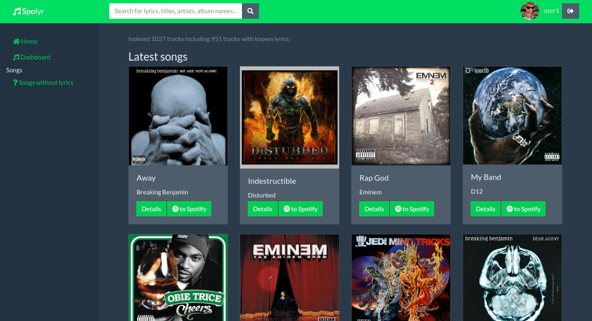
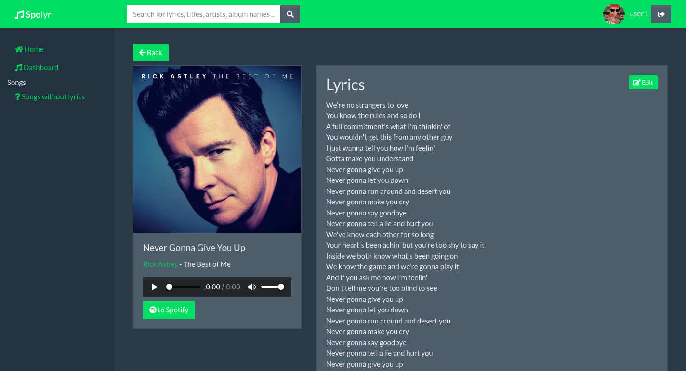
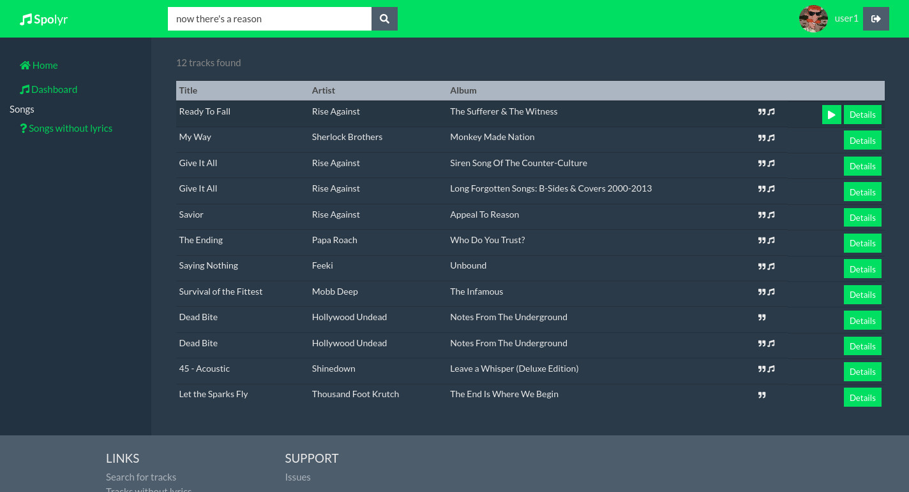
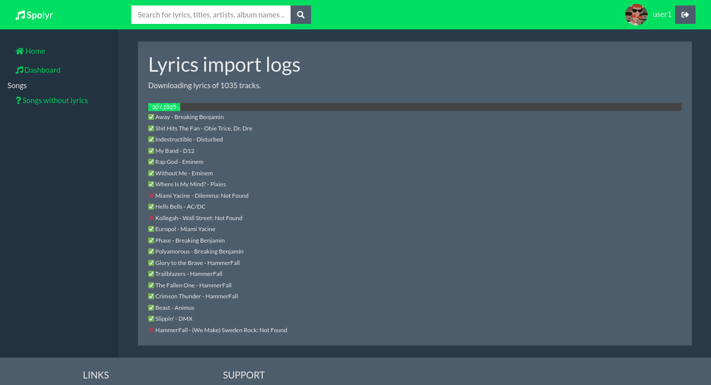

# Spolyr - a private Spotify lyrics index

Ever had the lyrics of a song stuck in your head for weeks but couldn't remember the title of the track? Did it nearly drive you crazy knowing the track is somewhere buried in your Spotify library? Fear not, Spolyr to the rescue!

Spolyr is a side project I've been working on that helps you index and retrieve your favorite songs on Spotify by querying a full-text index. 

## Features
- Sign in using your Spotify account and download all tracks in your library
- Import Spotify playlists
- Automatically fetch lyrics from different providers
- Find a specific song by querying a full-text search index

## Prerequisites
- go to https://developer.spotify.com/dashboard/applications and register a new app 
- go to http://genius.com/api-clients and get a new Genius API token
- MongoDB or preferably Docker

## How to get started? 

1. Set secrets as environment variables inside your `docker-compose.yml`
2. run `docker-compose up`
3. Open [localhost:8080](http://localhost:8080)

## Configuration options

`SPOTIFY_ID`: unique identifier of your Spotify application - **required**

`SPOTIFY_SECRET`: secret Spotify key - **required**

`GENIUS_API_TOKEN`: API token to use when communicating with genius.com - **required**

`SESSION_KEY`: key used for signing cookies. (default: a random key)

`PROTOCOL`: Http protocol (default: `http`)

`DOMAIN`: Domain name of this server. (default: `localhost`)

`HTTP_PORT`: Specifies the http port to bind Spolyr to (default: `8080`)

`HTTP_PUBLIC_PORT`: Specifies the public-facing http port. Set this to `443` or `80` if you are running Spolyr with a reverse proxy (default: value of `HTTP_PORT`)

`DATABASE_HOST`: (default: `127.0.0.1`)

`DATABASE_USER` default: `root`)

`DATABASE_PASSWORD` (default: `example`)

## Screenshots









```
docker run --rm -v "${PWD}:/local" openapitools/openapi-generator-cli generate \
    -i /local/index/oapi-spec.yaml \
    -g javascript \
    -o /local/internal/spec
```

## Development

1. Install `node`, `docker` and `docker compose`
2. Install frontend dependencies `npm i`
3. Generate the api and clients stubs: `make openapi-spec`
4. Start database: `docker compose -f docker-compose.dev.yml up`
5. Set the following environment variables:
   - DATABASE_HOST=127.0.0.1
   - DATABASE_PASSWORD=example
   - DATABASE_USER=root
   - DOMAIN=localhost
   - HTTP_PUBLIC_PORT=8081
   - PROTOCOL=https
   - SESSION_KEY=dev
   - SPOTIFY_ID=YOUR_ID
   - SPOTIFY_SECRET=YOUR_SECRET 
   - GENIUS_API_TOKEN=YOUR_TOKEN
6. Start api: `go run cmd/main.go`
7. Start webpack dev server: `npm run serve`
8. Open [localhost:8080](https://localhost:8080) in your preferred browser

### Tests and linting
```bash
npm run lint
npm run test:unit
```