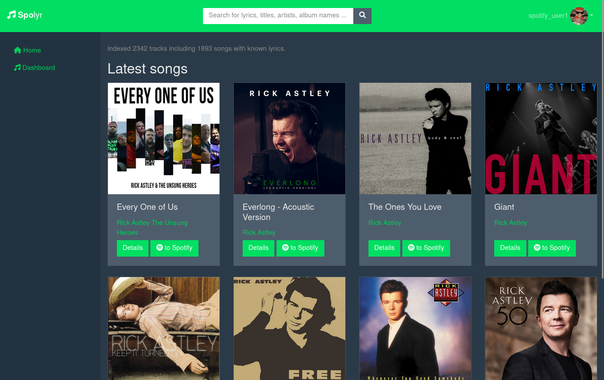
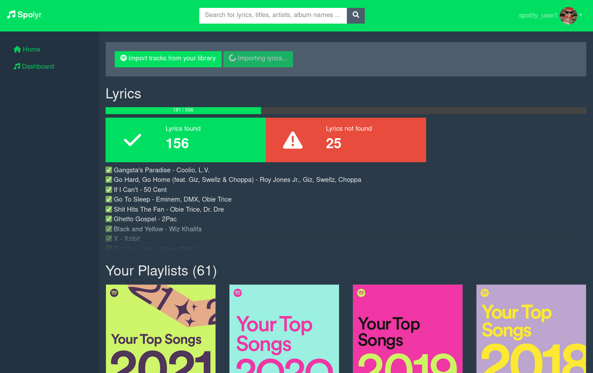

# Spolyr - Spotify Lyrics Index

Ever had the lyrics of a song stuck in your head for weeks but couldn't remember the title of the track? Did it nearly drive you crazy knowing the track is somewhere buried in your Spotify library? Fear not, Spolyr to the rescue!

Spolyr is a side project I've been working on that helps you index and retrieve your favorite songs on Spotify by querying a full-text index. 

## Prerequisites
- go to https://developer.spotify.com/dashboard/applications and register a new app 
- go to http://genius.com/api-clients and get a new Genius API token
- MongoDB or preferably Docker

## How to get started? 

1. Set secrets as environment variables inside your `docker-compose.yml`
2. `docker-compose up`
3. Open [localhost:8080](http://localhost:8080)

## Configuration options

> bold variables are required

**`SPOTIFY_ID`**: unique identifier of your Spotify application

**`SPOTIFY_SECRET`**: secret Spotify key

**`GENIUS_API_TOKEN`**: API token to use when communicating with genius.com

`PROTOCOL`: Http protocol (default: `http`)

`DOMAIN`: Domain name of this server. (default: `localhost`)

`HTTP_PORT`: Specifies the http port to bind Spolyr to (default: `8080`)

`HTTP_PUBLIC_PORT`: Specifies the public-facing http port. Set this to `443` or `80` if you are running Spolyr with a reverse proxy (default: value of `HTTP_PORT`)

`DATABASE_HOST`: (default: `127.0.0.1`)

`DATABASE_USER` default: `root`)

`DATABASE_PASSWORD` (default: `example`)

## Features

